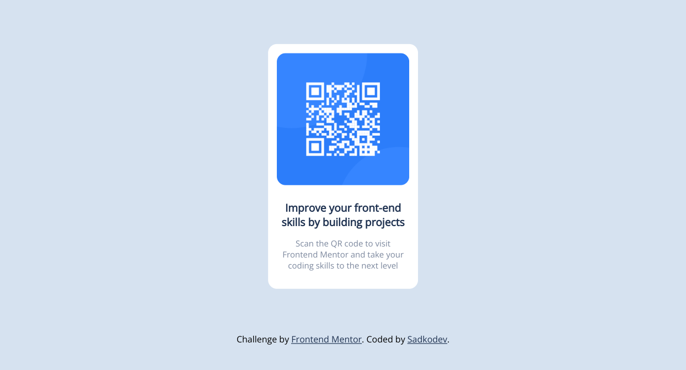

# Frontend Mentor - QR code component solution

This is a solution to the [QR code component challenge on Frontend Mentor](https://www.frontendmentor.io/challenges/qr-code-component-iux_sIO_H). Frontend Mentor challenges help you improve your coding skills by building realistic projects. 

## Table of contents

- [Frontend Mentor - QR code component solution](#frontend-mentor---qr-code-component-solution)
  - [Table of contents](#table-of-contents)
  - [Overview](#overview)
    - [Screenshot](#screenshot)
    - [Links](#links)
  - [My process](#my-process)
    - [Built with](#built-with)
  - [Author](#author)

## Overview

### Screenshot

### Links

- Solution URL: [Source code](https://github.com/sadkodev/Frontend-Mentor---QR-code-component-solution)
- Live Site URL: [Challenge #1](https://challenges.sadkodev.online/)

## My process

### Built with

- Semantic HTML5 markup
- CSS custom properties
- Flexbox

## Author

- Website - [sadkodev.online](https://sadkodev.online)
- Frontend Mentor - [@sadkodev](https://www.frontendmentor.io/profile/sadkodev)
- Twitter - [@sadkodev](https://www.twitter.com/sadkodev)
